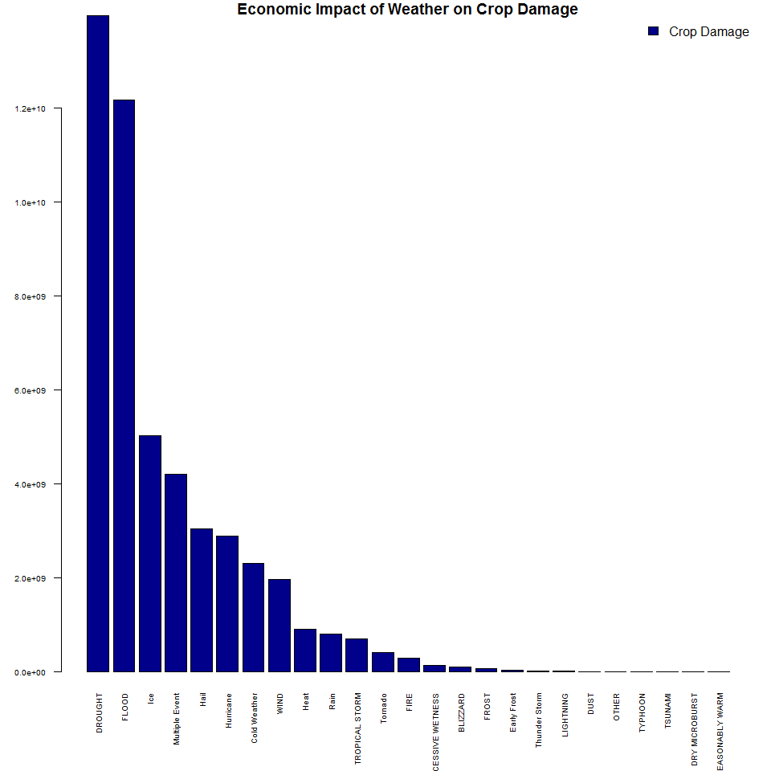

#  Storm Data Analysis
W. Aaron Morris  


# Overview
Synopsis: Exploratory Analysis of the NOAA Storm Database (1950-2011) to analyze severe weather outcomes.

Goals: 1. Identify events that are harmful to population health.
       2. Identify events that have the greatest economic consequences.


# Import Libraries and Create Functions

```r
library(dplyr)
```

```
## 
## Attaching package: 'dplyr'
```

```
## The following objects are masked from 'package:stats':
## 
##     filter, lag
```

```
## The following objects are masked from 'package:base':
## 
##     intersect, setdiff, setequal, union
```

```r
plot <- function(names, totals, columns, main, colors){
  colnames(totals) <- names
  
  par(las=2,mar=c(6,4,1,1))
  barplot(totals, col=colors,main=main,cex.names  = 0.6,cex.axis = 0.6)
  legend("topright", columns,fill=colors,bty = "n")
}
```

# Data Processing
Read the original files and display column names.

```r
StormData <- read.csv("data/StormData.csv.bz2")
colnames(StormData)
```

```
##  [1] "STATE__"    "BGN_DATE"   "BGN_TIME"   "TIME_ZONE"  "COUNTY"    
##  [6] "COUNTYNAME" "STATE"      "EVTYPE"     "BGN_RANGE"  "BGN_AZI"   
## [11] "BGN_LOCATI" "END_DATE"   "END_TIME"   "COUNTY_END" "COUNTYENDN"
## [16] "END_RANGE"  "END_AZI"    "END_LOCATI" "LENGTH"     "WIDTH"     
## [21] "F"          "MAG"        "FATALITIES" "INJURIES"   "PROPDMG"   
## [26] "PROPDMGEXP" "CROPDMG"    "CROPDMGEXP" "WFO"        "STATEOFFIC"
## [31] "ZONENAMES"  "LATITUDE"   "LONGITUDE"  "LATITUDE_E" "LONGITUDE_"
## [36] "REMARKS"    "REFNUM"
```

## Look through Labels given to Event Type.
Before splitting the data into two reliable sets, clean up any data that our analysis would use.
### 1. Identify Event Type Labels that should be scrubbed.

```r
event_types <- as.data.frame(table(StormData$EVTYPE))
event_types <- event_types[order(event_types$Var1), ]
```

###Clean up a majority of Identified Names
In order to properly count and categorize records that have possible multiple events, records that possess an ampersand, slash, or 'and' will be labeled as a multiple event.

The naming of the event is to be done on the general overriding idea behind the event. For example, wind 65+ will be categorized the same as wind 45+ because both specific events deal with the event type of wind. This is done over several different instances.

```r
StormData$EVTYPE <- as.character(StormData$EVTYPE)
StormData$EVTYPE[grepl("/|&|and", StormData$EVTYPE,ignore.case = TRUE)] <- "Multiple Event"
StormData$EVTYPE[grepl("volc", StormData$EVTYPE,ignore.case = TRUE)] <- "Volcano"
StormData$EVTYPE[grepl("wind|wnd", StormData$EVTYPE,ignore.case = TRUE)] <- "WIND"
StormData$EVTYPE[grepl("funnel|tornado", StormData$EVTYPE,ignore.case = TRUE)] <- "Tornado"
StormData$EVTYPE[grepl("glaze", StormData$EVTYPE,ignore.case = TRUE)] <- "Glaze"
StormData$EVTYPE[grepl("hail", StormData$EVTYPE,ignore.case = TRUE)] <- "Hail"
StormData$EVTYPE[grepl("dust", StormData$EVTYPE,ignore.case = TRUE)]  <- "DUST"
StormData$EVTYPE[grepl("flood", StormData$EVTYPE,ignore.case = TRUE)] <- "FLOOD"
StormData$EVTYPE[grepl("ic(e|y)", StormData$EVTYPE,ignore.case = TRUE)] <- "Ice"
StormData$EVTYPE[grepl("fire|smoke", StormData$EVTYPE,ignore.case = TRUE)] <- "FIRE"
StormData$EVTYPE[grepl("thunder", StormData$EVTYPE,ignore.case = TRUE)] <- "Thunder Storm"
StormData$EVTYPE[grepl("slide|eros", StormData$EVTYPE,ignore.case = TRUE)] <- "Erosion"
StormData$EVTYPE[grepl("rain", StormData$EVTYPE,ignore.case = TRUE)] <- "Rain"
StormData$EVTYPE[grepl("freez|cold|snow|chill|winter", StormData$EVTYPE,ignore.case = TRUE)] <- "Cold Weather"
StormData$EVTYPE[grepl("TROPICAL.STORM", StormData$EVTYPE,ignore.case = TRUE)] <- "TROPICAL STORM"
StormData$EVTYPE[grepl("heat", StormData$EVTYPE,ignore.case = TRUE)] <- "Heat"
StormData$EVTYPE[grepl("(hurri|opal)", StormData$EVTYPE,ignore.case = TRUE)] <- "Hurricane"
```

## Seperate Data To Relevant Data for Question

```r
health <- StormData[,(c(8,23:24))]
property<-StormData[,c(8,25:28)]
```

##Property Data Processing

### Magnitude Values
These columns identify the magnitude that the damage shoohuld be multiplied against to accurately assess damage amount. 

Replace the empty fields with the magnitude O 

```r
table(property$PROPDMGEXP)
```

```
## 
##             -      ?      +      0      1      2      3      4      5 
## 465934      1      8      5    216     25     13      4      4     28 
##      6      7      8      B      h      H      K      m      M 
##      4      5      1     40      1      6 424665      7  11330
```

```r
table(property$CROPDMGEXP)
```

```
## 
##             ?      0      2      B      k      K      m      M 
## 618413      7     19      1      9     21 281832      1   1994
```

```r
property$PROPDMGEXP<-factor(property$PROPDMGEXP,levels=c("H","K","M","B","h","m","O"))
property$PROPDMGEXP[is.na(property$PROPDMGEXP)] <- "O"

property$CROPDMGEXP<-factor(property$CROPDMGEXP,levels=c("K","M","B","k","m","O"))
property$CROPDMGEXP[is.na(property$CROPDMGEXP)] <- "O"
```

### Convert the magnitude into the multiplier used for calculating damage amount.
Using the following key to identify the multiplier for the orders of magnitude.
1. o(one) = 1
2. h(undred)=100
3. k(thousand)=1000
4. m(million)=1000000
5. b(billion)=1000000000


```r
property$PROPDMGEXP <- as.character(property$PROPDMGEXP)
property$CROPDMGEXP <- as.character(property$CROPDMGEXP)

property$PROPDMGMLT <- 0
property$CROPDMGMLT <- 0

property$PROPDMGMLT[grepl("h", property$PROPDMGEXP,ignore.case = TRUE)]<-100
property$PROPDMGMLT[grepl("k", property$PROPDMGEXP,ignore.case = TRUE)]<-1000
property$PROPDMGMLT[grepl("m", property$PROPDMGEXP,ignore.case = TRUE)]<-1000000
property$PROPDMGMLT[grepl("b", property$PROPDMGEXP,ignore.case = TRUE)]<-1000000000
property$PROPDMGMLT[grepl("o", property$PROPDMGEXP,ignore.case = TRUE)]<-1

property$CROPDMGMLT[grepl("k", property$CROPDMGEXP,ignore.case = TRUE)]<-1000
property$CROPDMGMLT[grepl("m", property$CROPDMGEXP,ignore.case = TRUE)]<-1000000
property$CROPDMGMLT[grepl("b", property$CROPDMGEXP,ignore.case = TRUE)]<-1000000000
property$CROPDMGMLT[grepl("o", property$CROPDMGEXP,ignore.case = TRUE)]<-1


property$PROPDMG <- property$PROPDMG * property$PROPDMGMLT
property$CROPDMG <- property$CROPDMG * property$CROPDMGMLT
property$total <- property$PROPDMG + property$CROPDMG
```

# Results
Now that everything is clean we will beign to analyze the data to answer our two goals for looking at this dataset

## Population Health Question

### Health Totals

```r
health.totals <- aggregate(cbind(FATALITIES,INJURIES) ~ EVTYPE, data = health, sum, na.rm=TRUE)
health.totals$TOTAL <- health.totals$FATALITIES + health.totals$INJURIES
health.totals <- health.totals[order(-health.totals$TOTAL), ]
health.totals <- health.totals[1:25,]


plot(health.totals$EVTYPE,
     as.matrix(t(health.totals[,c(-1,-4)])),
     colors = c("dark blue","red"),
     columns = c("Fatalities","Injuries"),
     main = "Most Harmful Event Type in the United States")
```

<!-- -->

#### Population Health Assessment
__It is easily said that tornado's cause the largest weather-related risk to the overall population health. However, the averages of the events tell a different story about the most deadly single weather events. This will require additional research and analysis to properly identify which event has the worst outcomes for popluation health.__

## Economic Impact
We will begin to look at the Economic Impact of certain types of events. 
### Economic Health Results

```r
economic.total <- aggregate(cbind(PROPDMG,CROPDMG, total) ~ EVTYPE, data = property, sum, na.rm=TRUE)
economic.crop <- economic.total[order(-economic.total$CROPDMG), ]
economic.crop <- economic.crop[1:25,]

economic.prop <- economic.total[order(-economic.total$PROPDMG), ]
economic.prop <- economic.prop[1:25,]

plot(economic.prop$EVTYPE,
     as.matrix(t(economic.prop[,c(-1,-3,-4)])),
     colors = c("dark blue","red"),
     columns = c("Property Damage"),
     main = "Economic Impact of Weather on Propery Damage")
```

<!-- -->

```r
plot(economic.crop$EVTYPE,
     as.matrix(t(economic.crop[,c(-1,-2,-4)])),
     colors = c("dark blue","red"),
     columns = c("Crop Damage"),
     main = "Economic Impact of Weather on Crop Damage")
```

<!-- -->

#### Economic Impact Assessment
__While drought has the largest impact on crops, it is easy to see that flooding produces the largest overall weather-related impact to the economy. With the cost fully associated with crop destruction is not in the scope of this analysis, futher research is required to determine the full economic impact of one of these weather related events.__
